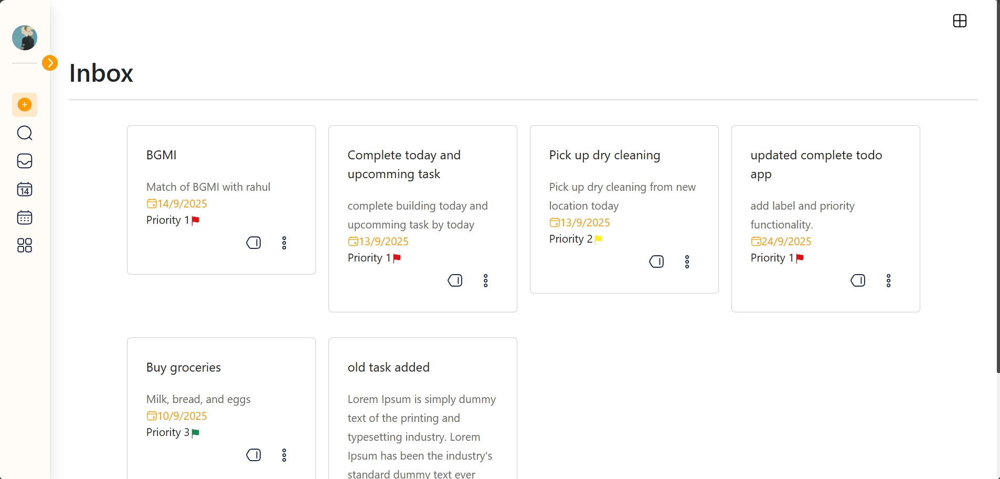
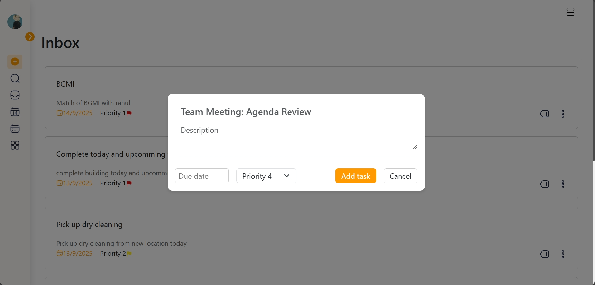
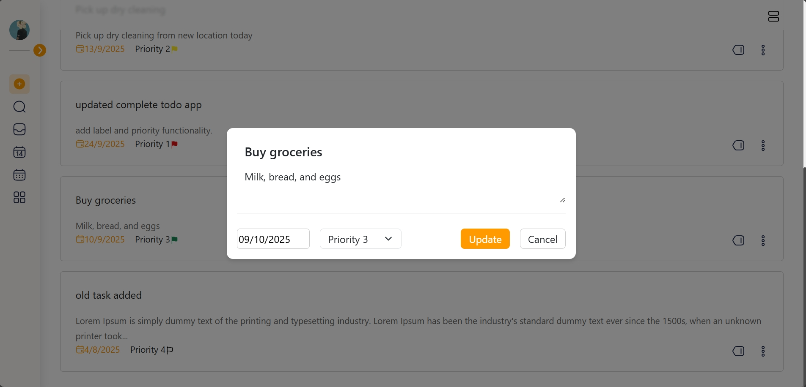
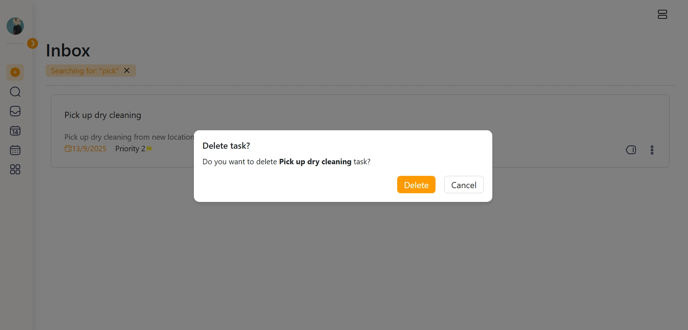
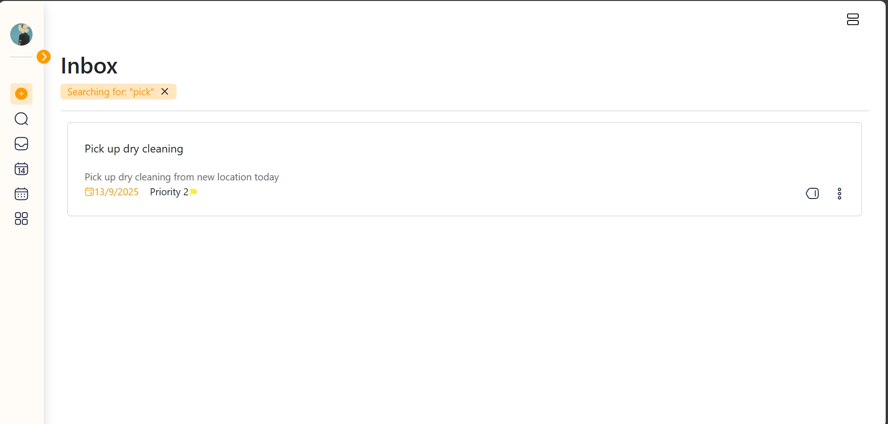
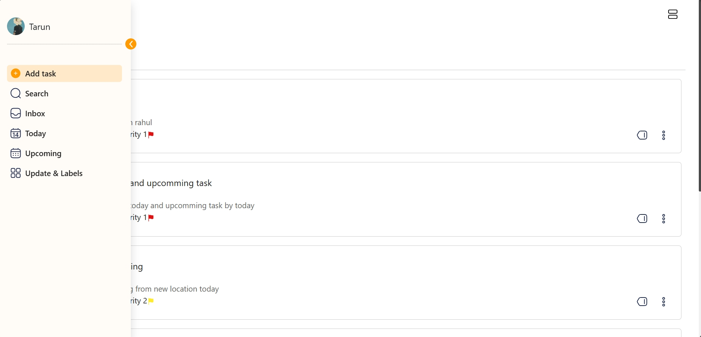

<h1>🚀 Karyam: Your Ultimate Task Companion 🚀</h1>

A fundamental to-do app, Karyam serves as a portfolio piece showcasing MERN stack development with an emphasis on clean code and robust CRUD functionality.

💻 Tech Stack & Features
This app isn't just about good looks—it's built with a powerful MERN stack, showcasing full-stack development skills from a responsive front-end to a robust back-end.

Front-end: A vibrant UI crafted with React.js for a smooth, dynamic user experience.

Back-end: Powered by Express.js and Node.js, with a MongoDB database to handle all your data efficiently.

CRUD Operations: Seamlessly create, read, update, and delete tasks using clean API calls.

Intuitive UI: A modern design that makes managing your tasks feel effortless.

✨ Key Features & UI Showcase
Grid Feature
Effortlessly switch between a compact list view and a spacious grid layout.

Add Task
A simple and straightforward way to add new tasks to your list, ensuring you never miss a beat.

Update Task
Easily edit existing tasks with a slick, user-friendly popup interface.

Delete Task
Confirm and delete tasks with a clear, concise popup, keeping your workspace clutter-free.

Search Function
Find any task in a flash with the powerful, case-insensitive search feature.

Dynamic Sidenav
Navigate your project with an elegant and functional sidebar that keeps everything within reach.

🌟 My Skills in Action
This project is a testament to my ability to build a full-featured application from the ground up. It demonstrates:

Responsive UI/UX design and implementation.

Mastery of React.js components and state management.

Full CRUD functionality using RESTful API design.

Efficient data handling with MongoDB.

Creating a cohesive and professional user experience.

