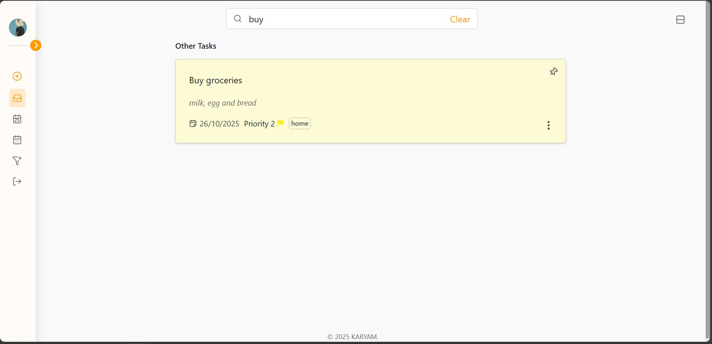

<div align="center">
<h1></img> Memo: Your Ultimate Task Companion</h1>
<p>A fundamental to-do application, Memo serves as a portfolio piece showcasing MERN stack development with an emphasis on **clean code, robust CRUD functionality, and JWT-based authentication**.</p>
</div>

## 💻 Tech Stack & Features

This application is built with a powerful **MERN stack**, showcasing full-stack development skills from a responsive front-end to a secure, robust back-end.

- **Front-end:** A vibrant UI crafted with **React.js** for a smooth, dynamic user experience.
- **Back-end:** Powered by **Express.js** and **Node.js**, with a **MongoDB** database to handle all data efficiently.
- **CRUD Operations:** Seamlessly **create, read, update, and delete** tasks using clean RESTful API calls.
- **Security:** Robust **JWT-based token authentication** protecting all routes.
- **Intuitive UI:** A modern design that makes managing your tasks feel effortless.

---

## 🚀 Getting Started

Follow these steps to get Memo running on your local machine:

1.  Clone the repository:
    ```bash
    git clone [Your Repo URL Here]
    ```
2.  Navigate to the project directory and install dependencies (for both client and server):
    ```bash
    npm install
    ```
3.  Start the application (this command will typically run both the client and server concurrently):
    ```bash
    npm run dev
    ```
    _(Note: You may need to create a `.env` file for MongoDB connection string and JWT secret.)_

---

## ✨ Key Features & UI Showcase

### Grid Feature

Effortlessly switch between a compact list view and a spacious grid layout.


### Add Task

A simple and straightforward way to add new tasks to your list, ensuring you never miss a beat.


### Update Task

Easily edit existing tasks with a slick, user-friendly popup interface.


### Delete Task

Confirm and delete tasks with a clear, concise popup, keeping your workspace clutter-free.


### Search Function

Find any task in a flash with the powerful, case-insensitive search feature.


### Dynamic Sidenav

Navigate your tasks with an elegant and functional sidebar that keeps everything within reach.


### Filter Page

The **Filter Page** allows users to quickly find tasks using a powerful, dynamic filter based on **color, priority, and label**.


### Login Page

A UI-rich Login page featuring **encrypted security** and **JWT token authentication** to protect user data and routes at every step.


### Mobile View

|                  Grid View in Mobile                   |                    Sidebar in Mobile                     |
| :----------------------------------------------------: | :------------------------------------------------------: |
|  |  |

---

## 🌟 My Skills in Action

This project is a testament to my ability to build a full-featured application from the ground up. It demonstrates:

- **Responsive UI/UX design** and implementation.
- **Mastery of React.js components** and complex state management.
- Full **CRUD functionality** using **RESTful API design**.
- Implementing **JWT-based authentication** for secure route protection.
- Efficient data handling and modeling with **MongoDB**.
- Creating a cohesive and professional user experience.
